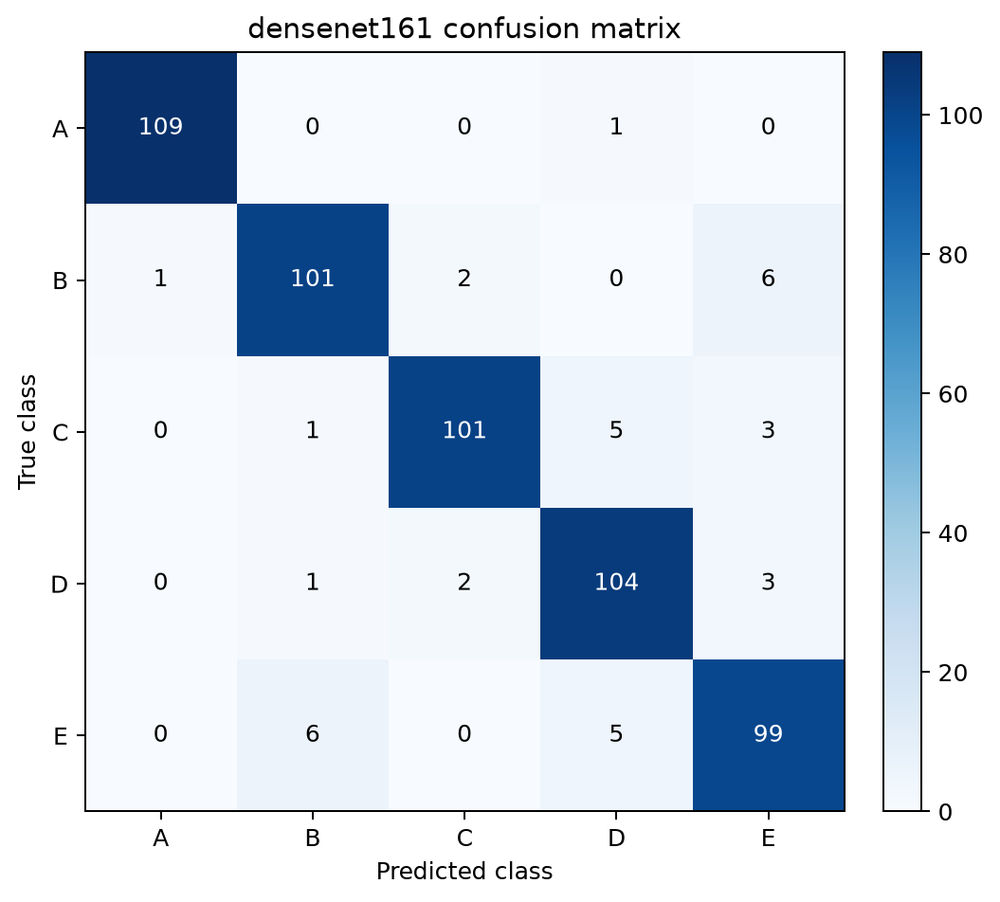
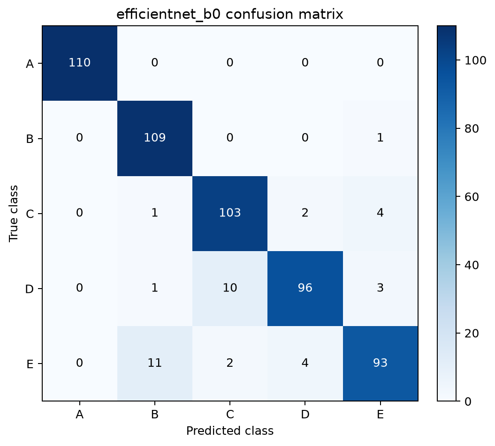
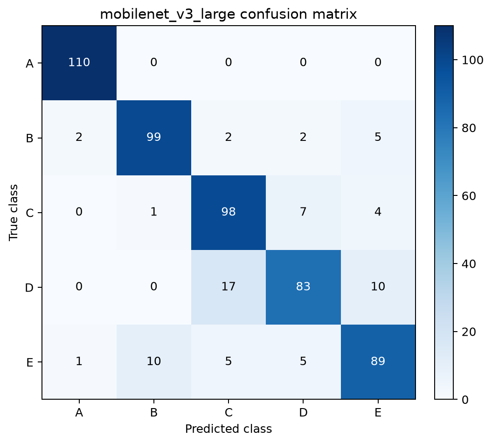

# sEMG-Based Authentication Project: Reproduction and Improvement

손잡이를 회전할 때 측정한 **2채널 손바닥 표면 근전도(sEMG)** 신호로 사용자 5명(`A`~`E`)을 인증하는 프로젝트입니다. 원시 시계열을 필터링하고 CWT(Continuous Wavelet Transform) 이미지로 변환한 뒤, 네 가지 CNN 모델을 동일한 조건에서 학습·비교했습니다.

이 프로젝트는 원 연구의 DenseNet161 기반 분류를 재현하고, ResNet18·EfficientNet-B0·MobileNetV3-Large까지 비교하여 정확도뿐 아니라 모델 크기와 실행 시간의 균형을 분석합니다.

## 프로젝트 구조

```text
C1/
├─ semg_auth/                  # 전처리와 데이터 로딩 공통 모듈
├─ scripts/                    # 데이터 생성, 학습, 평가, 벤치마크 실행 모듈
├─ tools/                      # 원본 데이터와 전처리 수동 점검 도구
├─ archive/legacy/             # 현재 주 파이프라인 이전 코드
├─ data/
│  ├─ raw/                     # 피험자별 원본 CSV
│  └─ processed/               # WIN/HOP 설정별 NPZ 데이터셋
├─ artifacts/
│  ├─ runs/                    # 실험별 체크포인트, 지표, 평가 결과
│  └─ analysis/                # 신호 분석 결과
└─ docs/                       # 환경 설정 메모 등 보조 문서
```

실행 파일은 프로젝트 루트에서 `python -m scripts.<모듈명>` 형식으로 실행합니다. 실험 결과는 모델별로 흩어 두지 않고 `baseline_win500_hop250`, `improved_win500_hop250`처럼 하나의 실행 설정 아래에 모아 관리합니다.

## 1. 데이터 및 전처리

### 데이터 구성

- 피험자: 5명 (`A`, `B`, `C`, `D`, `E`)
- 시행 횟수: 피험자당 50회, 총 250개 CSV 파일
- 채널: 2개 (`APB`, `ADM`)
- 샘플링 주파수: 1,000 Hz
- 1회 시행: 잡기 1초 → 회전 1초 → 정지 1초, 총 3초
- 분할: 계층화된 파일 단위 80:20 분할 (`random_state=42`)
  - 학습용: 200개 시행, 2,200개 윈도우
  - 독립 테스트용: 50개 시행, 550개 윈도우

윈도우를 먼저 만든 뒤 나누지 않고 **CSV 시행 단위로 먼저 분할**하여, 같은 시행에서 나온 구간이 학습 세트와 테스트 세트에 동시에 들어가는 데이터 누수를 방지했습니다. 학습용 200개 시행 안에서 다시 Stratified 5-Fold 교차검증을 수행합니다.

### 전처리 순서

1. 60 Hz 노치 필터(`Q=30`)로 전원선 잡음 제거
2. 4차 Butterworth 20~499 Hz 대역통과 필터
3. 500 samples(500 ms) 윈도우, 250 samples(250 ms) 간격으로 분할
4. 윈도우별 Min-Max 정규화
5. Morlet wavelet과 32개 scale을 이용한 CWT 변환
6. 채널 1, 채널 2, 두 채널 CWT의 평균을 쌓아 `(3, 32, 500)` 입력 생성

전처리된 한 샘플의 형태는 다음과 같습니다.

```text
2-channel signal (500, 2)
        ↓ CWT
channel 1 map (32, 500)
channel 2 map (32, 500)
average map   (32, 500)
        ↓ stack
CNN input (3, 32, 500)
```

## 2. 사용 모델 및 학습 방법

다음 네 모델은 ImageNet 사전학습 가중치를 사용하지 않고(`weights=None`) 처음부터 학습했습니다. 각 모델의 마지막 분류층을 5개 클래스 출력으로 변경했으며, DenseNet161과 ResNet18에는 분류층 앞에 Dropout 0.2를 적용했습니다.

- DenseNet161
- ResNet18
- EfficientNet-B0
- MobileNetV3-Large

최종 실험은 `scripts/train_improved_cv.py`로 수행했습니다. 공통 학습 설정은 다음과 같습니다.

| 항목 | 설정 |
|---|---:|
| Loss | Cross Entropy |
| Optimizer | AdamW |
| Learning rate | 0.001 |
| Weight decay | 0.0001 |
| Batch size | 16 |
| CV 최대 Epochs | 60 |
| Early stopping patience | 12 |
| Scheduler | CosineAnnealingLR |
| Folds | Stratified 5-Fold |
| Random seed | 42 |

개선된 학습·평가 절차는 다음과 같습니다.

1. 각 Fold를 새 모델로 독립 학습하고, 검증 정확도가 가장 높은 체크포인트를 저장합니다. 동률이면 검증 손실이 더 낮은 모델을 선택합니다.
2. 12 Epoch 동안 검증 성능이 개선되지 않으면 조기 종료합니다.
3. 특정 Fold의 가중치를 재사용하지 않고, 모든 Fold의 best epoch 중앙값에 학습 샘플 수 비율(1,760/2,200=0.8)을 적용해 최종 Epoch를 정합니다.
4. 최종 모델은 전체 학습 세트에서 **새 모델로 처음부터** 학습합니다.
5. 학습과 모델 선택이 모두 끝난 후, 분리해 둔 50개 CSV 시행에서 나온 550개 윈도우를 학습 스크립트 내에서 1회 평가합니다. 이 결과는 모델이나 하이퍼파라미터 선택에 사용하지 않습니다.
6. 11개 윈도우의 logit을 평균해 CSV 시행 단위 인증 성능도 함께 보고합니다.

## 3. 실행 방법

### 환경 설치

Python 3.13 및 CUDA 지원 GPU 환경에서 실행했습니다.

```bash
python -m venv .venv

# Windows
.venv\Scripts\activate

pip install -r requirements.txt
```

### 데이터 배치

원본 CSV 파일을 다음 구조로 배치합니다.

```text
data/raw/
├── A/
├── B/
├── C/
├── D/
└── E/
```

각 폴더에는 해당 피험자의 CSV 파일 50개가 있어야 합니다. 원 데이터의 자세한 설명과 라이선스는 [`data/README.md`](data/README.md)와 [`data/LICENSE`](data/LICENSE)를 참고하세요.

### 데이터셋 생성

```bash
python -m scripts.build_five_fold_dataset
```

위 명령은 독립 학습/테스트 세트와 5개 교차검증 Fold를 `data/processed/win500_hop250/`에 생성합니다.

### 모델 학습

모델명을 인자로 지정해 개선된 학습 파이프라인을 실행합니다.

```bash
python -m scripts.train_improved_cv --model densenet161
python -m scripts.train_improved_cv --model resnet18
python -m scripts.train_improved_cv --model efficientnet_b0
python -m scripts.train_improved_cv --model mobilenet_v3_large
```

각 실험의 전체 학습 이력, OOF 성능, 혼동행렬, classification report, 윈도우/CSV 단위 독립 테스트 결과가 `artifacts/runs/improved_win500_hop250/metrics/results_5fold_improved_<model>.json`에 저장됩니다.

### 전체 모델 평가 및 혼동행렬 생성

```bash
python -m scripts.evaluate_models --variant improved
```

평가 결과는 `artifacts/runs/improved_win500_hop250/evaluation/model_comparison.json`에, 혼동행렬은 모델별 PNG 파일로 저장됩니다. 기존 모델을 다시 평가하려면 `--variant baseline`을 사용합니다.

## 4. 코드 설명

| 파일 | 설명 |
|---|---|
| `semg_auth/preprocessing.py` | 노치/대역통과 필터, 슬라이딩 윈도우, 정규화, CWT 변환 |
| `semg_auth/data_loading.py` | 일반·Fold·독립 테스트 NPZ 데이터 로드 |
| `scripts/build_standard_dataset.py` | 원본 CSV 로드, 사용자 라벨 생성, 일반 train/test 데이터셋 생성 |
| `scripts/build_five_fold_dataset.py` | 독립 테스트 세트 및 누수 방지 5-Fold 데이터셋 생성 |
| `scripts/train_improved_cv.py` | AdamW, 조기 종료, OOF/CSV 단위 평가, CV 기반 Epoch 산정, 새 모델 최종 학습 |
| `scripts/train_baseline_cv.py` | 기존 45 Epoch 5-Fold 학습과 기준 성능 재현 |
| `scripts/evaluate_models.py` | `baseline`/`improved` 최종 모델의 평가 JSON 및 혼동행렬 PNG 생성 |
| `scripts/benchmark_models.py` | 파라미터 수, 45 Epoch 학습 시간, 샘플당 추론 시간 측정 |
| `scripts/evaluate_checkpoint.py` | 지정한 단일 체크포인트의 분류 성능을 콘솔에서 확인 |
| `archive/legacy/` | 현재 주 파이프라인 이전의 학습 코드 보관 |
| `tools/` | 원본 데이터와 전처리 결과를 수동으로 점검하는 도구 |

## 5. 모델 성능 비교

### 개선 모델의 독립 테스트 성능

Precision, Recall, F1-score는 다중 클래스 간 비중을 동일하게 반영한 **Macro average**입니다.

| Model | Accuracy | Precision | Recall | F1-score | CSV 정확도 | 최종 Epoch |
|---|---:|---:|---:|---:|---:|---:|
| **DenseNet161** | **93.45%** | **93.51%** | **93.45%** | **93.46%** | **100% (50/50)** | 18 |
| EfficientNet-B0 | 92.91% | 93.02% | 92.91% | 92.85% | **100% (50/50)** | 19 |
| ResNet18 | 87.45% | 87.87% | 87.45% | 87.32% | 96% (48/50) | 6 |
| MobileNetV3-Large | 87.09% | 87.13% | 87.09% | 87.00% | **100% (50/50)** | 33 |

DenseNet161이 윈도우 단위 Accuracy와 F1-score에서 가장 좋은 성능을 보였고, EfficientNet-B0가 뒤를 이었습니다. CSV 시행의 11개 윈도우 logit을 평균하면 DenseNet161, EfficientNet-B0, MobileNetV3-Large는 50개 테스트 시행을 모두 올바르게 인증했습니다. 550개 윈도우는 50개 서로 분리된 CSV에서 나왔지만 각 CSV 내의 윈도우는 서로 겹치므로, 550개를 모두 완전히 독립된 관측치로 해석하면 안 됩니다. 실제 인증이 단일 윈도우보다 일정 구간의 신호를 종합해 이루어진다는 점에서 CSV 단위 결과도 함께 보고했습니다.

### 기존 대비 개선 결과

| Model | 기존 Accuracy | 개선 Accuracy | 변화 | 기존 F1 | 개선 F1 |
|---|---:|---:|---:|---:|---:|
| DenseNet161 | 91.64% | **93.45%** | **+1.82%p** | 91.60% | **93.46%** |
| EfficientNet-B0 | 92.18% | **92.91%** | **+0.73%p** | 92.14% | **92.85%** |
| MobileNetV3-Large | 86.36% | **87.09%** | **+0.73%p** | 86.49% | **87.00%** |
| ResNet18 | **92.55%** | 87.45% | **-5.09%p** | **92.46%** | 87.32% |

여기서 '개선'은 모든 모델의 수치가 반드시 상승했다는 뜻이 아니라, **데이터 누수를 더 엄격히 차단하고 최종 학습 Epoch를 CV로 정하는 학습·평가 절차의 개선**을 의미합니다. ResNet18은 Fold별 best epoch가 `6, 7, 8, 25, 40`으로 편차가 큰데 중앙값과 샘플 수 보정으로 최종 Epoch가 6으로 산정되었습니다. 이로 인한 과소학습이 성능 하락의 가능성 높은 원인이며, 향후 최소 Epoch 하한을 두거나 중앙값 대신 상위 사분위수를 사용해 개선할 수 있습니다.

### 개선된 5-Fold 검증 결과

`WIN=500`, `HOP=250`에서의 Fold별 최고 검증 정확도입니다. 모든 Fold의 크기가 같아 평균은 OOF 윈도우 정확도와 같습니다.

| Model | Fold 1 | Fold 2 | Fold 3 | Fold 4 | Fold 5 | OOF 윈도우 | OOF CSV | 최종 Epoch |
|---|---:|---:|---:|---:|---:|---:|---:|---:|
| EfficientNet-B0 | 91.82% | 92.73% | 91.82% | 94.09% | 93.18% | **92.73% ± 0.86%** | **100%** | 19 |
| DenseNet161 | 89.09% | 92.73% | 91.82% | 91.14% | 94.77% | 91.91% ± 1.87% | 99.5% | 18 |
| MobileNetV3-Large | 89.09% | 92.27% | 91.59% | 92.73% | 92.05% | 91.55% ± 1.28% | **100%** | 33 |
| ResNet18 | 87.27% | 89.55% | 92.50% | 93.41% | 89.55% | 90.45% ± 2.22% | 99.0% | 6 |

교차검증은 학습 세트 내부의 모델 선택용 결과이고, 독립 테스트는 모든 설정과 학습이 완료된 후 보고용으로만 사용했습니다.

### 모델 크기와 실행 비용

아래 시간은 동일한 로컬 환경(NVIDIA GeForce RTX 4070)에서 기존 45 Epoch 학습 및 batch size 1 추론을 측정한 **구조별 연산 비용 참고치**입니다. 조기 종료가 적용된 개선 파이프라인의 전체 실행 시간은 별도로 재지 않았습니다.

| Model | 학습 가능 파라미터 | 학습 시간 | 샘플당 추론 시간 |
|---|---:|---:|---:|
| DenseNet161 | 26,483,045 | 907.8초 | 25.731 ms |
| ResNet18 | 11,179,077 | **131.8초** | **3.544 ms** |
| EfficientNet-B0 | **4,013,953** | 335.1초 | 8.839 ms |
| MobileNetV3-Large | 4,208,437 | 238.2초 | 5.353 ms |

ResNet18은 구조적으로 가장 빠른 학습과 추론을 보였지만, 개선 파이프라인에서 최종 Epoch가 6으로 짧게 산정되어 정확도 장점을 유지하지 못했습니다. 최고 윈도우 정확도가 필요하면 DenseNet161, 파라미터 수와 정확도의 균형을 우선하면 EfficientNet-B0가 적합합니다. 단, CSV 단위로는 두 모델 모두 100%를 기록했습니다.

## 6. Confusion Matrix 및 분석

혼동행렬은 행이 실제 클래스, 열이 예측 클래스이며 각 클래스의 테스트 샘플 수는 110개입니다.

### DenseNet161



- 가장 잘 분류된 클래스: `A` — 109/110, Recall 99.09%
- 가장 많이 오분류된 클래스: `E` — 99/110, Recall 90.00%
- 가장 큰 오분류: `B → E`, `E → B` 각 6건
- 주요 오분류 유형: `C → D`, `E → D` 각 5건

### ResNet18


- 가장 잘 분류된 클래스: `A` — 110/110, Recall 100.00%
- 가장 많이 오분류된 클래스: `D` — 79/110, Recall 71.82%
- 가장 큰 오분류: `D → C` 26건
- 주요 오분류 유형: `E → B` 10건, `C → D` 7건, `E → D` 7건

### EfficientNet-B0



- 가장 잘 분류된 클래스: `A` — 110/110, Recall 100.00%
- 가장 많이 오분류된 클래스: `E` — 93/110, Recall 84.55%
- 가장 큰 오분류: `E → B` 11건
- 주요 오분류 유형: `D → C` 10건, `C → E` 4건, `E → D` 4건

### MobileNetV3-Large



- 가장 잘 분류된 클래스: `A` — 110/110, Recall 100.00%
- 가장 많이 오분류된 클래스: `D` — 83/110, Recall 75.45%
- 가장 큰 오분류: `D → C` 17건
- 주요 오분류 유형: `D → E`, `E → B` 각 10건, `C → D` 7건

### 공통 오분류 원인 분석

모든 모델이 클래스 `A`를 99.09% 이상 안정적으로 분류했습니다. DenseNet161과 EfficientNet-B0에서는 클래스 `E`, ResNet18과 MobileNetV3-Large에서는 클래스 `D`의 Recall이 가장 낮았습니다. 특히 ResNet18의 `D → C` 26건은 다른 오분류보다 크게 나타났으며, 최종 모델의 과소학습 가능성과도 일치합니다. 전반적인 `B·C·D·E` 사이의 오분류는 동일한 손잡이 회전 동작의 일부 시간-주파수 패턴이 겹치기 때문으로 볼 수 있습니다. 센서 접촉 위치, 피부 임피던스, 힘의 크기, 회전 속도의 시행별 변화도 클래스 내부 분산을 키울 수 있습니다.

현재 정규화는 윈도우별 최솟값과 최댓값을 기준으로 하므로 사용자별 절대 진폭 차이를 제거합니다. 이 방식은 측정 환경 변화에 강해질 수 있지만, 개인 식별에 유효한 진폭 정보도 함께 줄일 수 있습니다. 향후 RMS, MAV, waveform length 같은 시간영역 특징을 CWT 특징과 결합하거나, 채널별 정규화 및 데이터 증강을 적용하면 특히 클래스 `E`의 분류 성능을 개선할 가능성이 있습니다.

## 7. 최종 결과

- 가장 성능이 좋은 모델: **DenseNet161** — 독립 테스트 Accuracy 93.45%, Macro F1 93.46%
- 가장 성능이 낮은 모델: **MobileNetV3-Large** — 독립 테스트 Accuracy 87.09%, Macro F1 87.00%
- 가장 안정적으로 분류된 클래스: **A**
- 주요 오분류 클래스: **D**와 **E**
- 최고 윈도우 성능: **DenseNet161**
- 경량성과 정확도의 균형: **EfficientNet-B0** — 4,013,953 parameters, Accuracy 92.91%
- CSV 단위 100% 인증: **DenseNet161, EfficientNet-B0, MobileNetV3-Large**

개선된 파이프라인은 특정 Fold 가중치를 이어받는 편향을 제거하고, 조기 종료와 AdamW로 과적합을 억제하며, 독립 테스트를 보고용으로만 사용하도록 정리했습니다. 그 결과 DenseNet161, EfficientNet-B0, MobileNetV3-Large의 독립 테스트 성능이 상승했습니다. 다만 ResNet18은 CV best epoch 분포가 불안정해 최종 학습 길이가 너무 짧게 정해졌으며, 이는 현재 Epoch 산정 규칙의 보완 필요성을 보여줍니다. 최종적으로 정확도를 우선하면 DenseNet161, 경량성과 성능의 균형을 우선하면 EfficientNet-B0가 가장 적합합니다.

## 8. 생성 파일과 대용량 파일 안내

`*.npz`, `*.pth`, `data/raw/`, 체크포인트와 중간 분석 결과는 용량 또는 데이터 배포 문제로 `.gitignore`에 포함되어 있습니다. GitHub에는 재현 코드, README, 최종 평가 JSON과 혼동행렬 PNG가 올라가며, 대용량 파일은 실행 과정에서 로컬에 생성됩니다.

```text
data/processed/win500_hop250/*.npz
data/processed/win500_hop250/folds/*.npz
artifacts/runs/improved_win500_hop250/checkpoints/<model>/cross_validation/*.pth
artifacts/runs/improved_win500_hop250/checkpoints/<model>/final/*.pth
artifacts/runs/improved_win500_hop250/metrics/results_5fold_improved_<model>.json
artifacts/runs/improved_win500_hop250/evaluation/model_comparison.json
artifacts/runs/improved_win500_hop250/evaluation/confusion_matrix_<model>.png
```

`artifacts/runs/improved_win500_hop250/evaluation/`의 최종 평가 JSON과 PNG는 Git으로 관리할 수 있도록 유지했습니다. 대용량 학습 데이터와 체크포인트, 중간 분석 결과는 Git 추적에서 제외됩니다.

## 9. 데이터 출처 및 라이선스

데이터셋: *Palm sEMG-based user authentication during doorknob rotation using a convolutional neural network*

- Authors: Yeonjung Shin, Junghun Kim, Sang-Il Choi
- Data license: CC BY 4.0
- IRB: Kyungpook National University Hospital, KNUH 2025

데이터를 재사용할 때는 원 저작자를 표시하고 [`data/LICENSE`](data/LICENSE)의 조건을 따라야 합니다.
