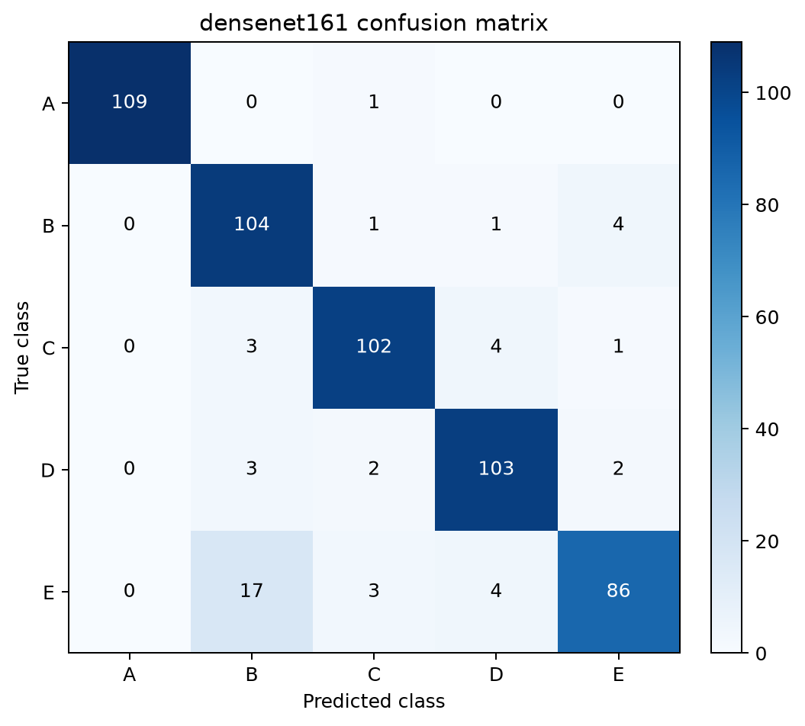
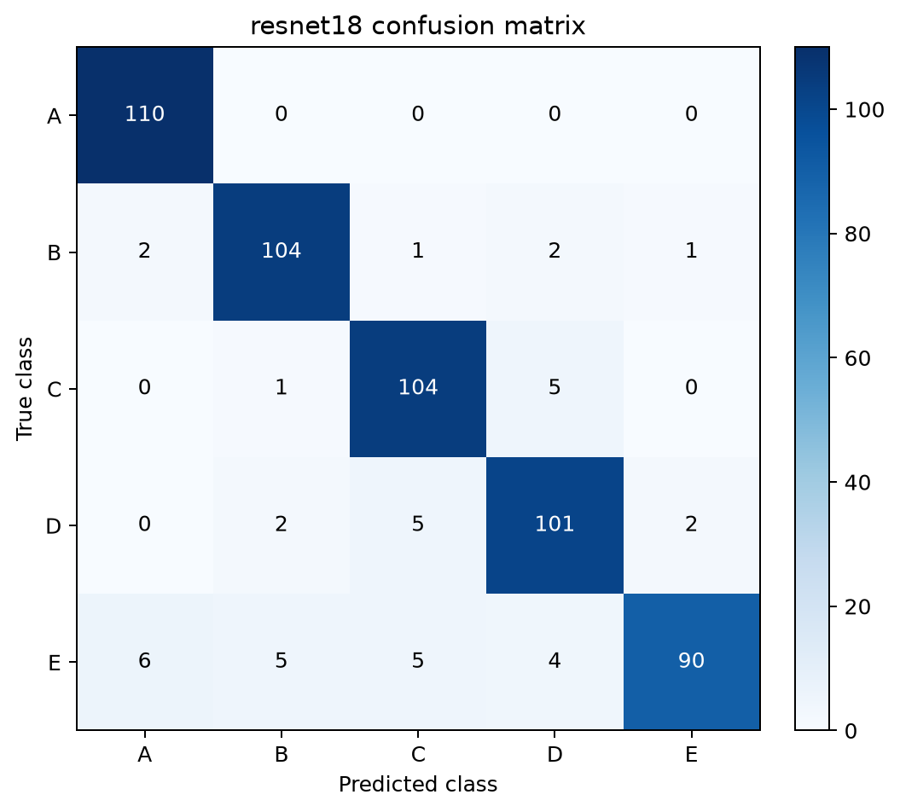
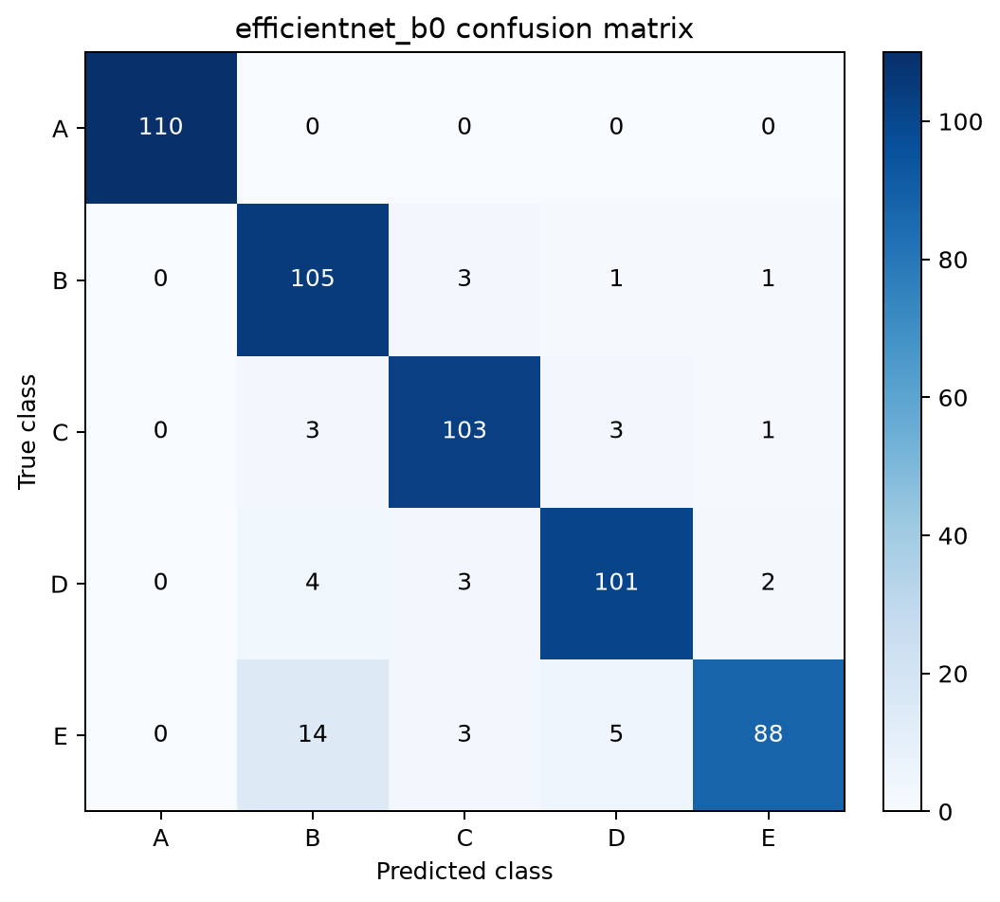
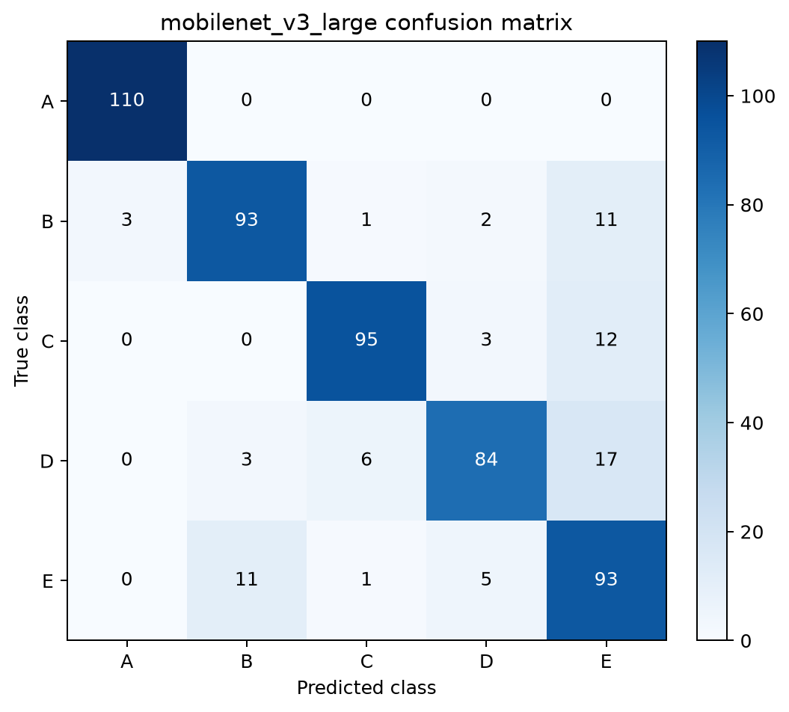

# sEMG-Based Authentication Project: Reproduction and Improvement

손잡이를 회전할 때 측정한 **2채널 손바닥 표면 근전도(sEMG)** 신호로 사용자 5명(`A`~`E`)을 인증하는 프로젝트입니다. 원시 시계열을 필터링하고 CWT(Continuous Wavelet Transform) 이미지로 변환한 뒤, 네 가지 CNN 모델을 동일한 조건에서 학습·비교했습니다.

이 프로젝트는 원 연구의 DenseNet161 기반 분류를 재현하고, ResNet18·EfficientNet-B0·MobileNetV3-Large까지 비교하여 정확도뿐 아니라 모델 크기와 실행 시간의 균형을 분석합니다.

## 1. 데이터 및 전처리

### 데이터 구성

- 피험자: 5명 (`A`, `B`, `C`, `D`, `E`)
- 시행 횟수: 피험자당 50회, 총 250개 CSV 파일
- 채널: 2개 (`APB`, `ADM`)
- 샘플링 주파수: 1,000 Hz
- 1회 시행: 잡기 1초 → 회전 1초 → 정지 1초, 총 3초
- 분할: 계층화된 파일 단위 80:20 분할 (`random_state=42`)
  - 학습용: 200개 시행, 2,200개 윈도우
  - 독립 테스트용: 50개 시행, 550개 윈도우

윈도우를 먼저 만든 뒤 나누지 않고 **CSV 시행 단위로 먼저 분할**하여, 같은 시행에서 나온 구간이 학습 세트와 테스트 세트에 동시에 들어가는 데이터 누수를 방지했습니다. 학습용 200개 시행 안에서 다시 Stratified 5-Fold 교차검증을 수행합니다.

### 전처리 순서

1. 60 Hz 노치 필터(`Q=30`)로 전원선 잡음 제거
2. 4차 Butterworth 20~499 Hz 대역통과 필터
3. 500 samples(500 ms) 윈도우, 250 samples(250 ms) 간격으로 분할
4. 윈도우별 Min-Max 정규화
5. Morlet wavelet과 32개 scale을 이용한 CWT 변환
6. 채널 1, 채널 2, 두 채널 CWT의 평균을 쌓아 `(3, 32, 500)` 입력 생성

전처리된 한 샘플의 형태는 다음과 같습니다.

```text
2-channel signal (500, 2)
        ↓ CWT
channel 1 map (32, 500)
channel 2 map (32, 500)
average map   (32, 500)
        ↓ stack
CNN input (3, 32, 500)
```

## 2. 사용 모델 및 학습 방법

다음 네 모델은 ImageNet 사전학습 가중치를 사용하지 않고(`weights=None`) 처음부터 학습했습니다. 각 모델의 마지막 분류층을 5개 클래스 출력으로 변경했으며, DenseNet161과 ResNet18에는 분류층 앞에 Dropout 0.2를 적용했습니다.

- DenseNet161
- ResNet18
- EfficientNet-B0
- MobileNetV3-Large

공통 학습 설정은 다음과 같습니다.

| 항목 | 설정 |
|---|---:|
| Loss | Cross Entropy |
| Optimizer | Adam |
| Learning rate | 0.001 |
| Batch size | 16 |
| Epochs | 45 |
| Scheduler | CosineAnnealingLR |
| Folds | Stratified 5-Fold |
| Random seed | 42 |

각 Fold는 새 모델로 독립 학습합니다. 검증 정확도가 가장 높은 체크포인트를 저장하고, 정확도가 같으면 검증 손실이 더 낮은 체크포인트를 선택합니다. 선택한 Fold 가중치에서 전체 학습 세트로 25 Epoch를 추가 학습한 최종 모델을, **학습 및 모델 선택에 사용하지 않은 550개 독립 테스트 윈도우**에서 단 한 번 평가했습니다.

## 3. 실행 방법

### 환경 설치

Python 3.13 및 CUDA 지원 GPU 환경에서 실행했습니다.

```bash
python -m venv .venv

# Windows
.venv\Scripts\activate

pip install -r requirements.txt
```

### 데이터 배치

원본 CSV 파일을 다음 구조로 배치합니다.

```text
data/raw/
├── A/
├── B/
├── C/
├── D/
└── E/
```

각 폴더에는 해당 피험자의 CSV 파일 50개가 있어야 합니다. 원 데이터의 자세한 설명과 라이선스는 [`data/README.md`](data/README.md)와 [`data/LICENSE`](data/LICENSE)를 참고하세요.

### 데이터셋 생성

```bash
python five_fold_data_mk.py
```

위 명령은 독립 학습/테스트 세트와 5개 교차검증 Fold를 `data/5fold dataset/`에 생성합니다.

### 모델 학습

`five_fold_new.py`의 `MODEL_NAME`을 아래 값 중 하나로 설정한 뒤 실행합니다.

```python
MODEL_NAME = "densenet161"
# densenet161, resnet18, efficientnet_b0, mobilenet_v3_large
```

```bash
python five_fold_new.py
```

### 전체 모델 평가 및 혼동행렬 생성

```bash
python evaluation.py
```

평가 결과는 `artifacts/evaluation/model_comparison.json`에, 혼동행렬은 모델별 PNG 파일로 저장됩니다.

## 4. 코드 설명

| 파일 | 설명 |
|---|---|
| `preprocess.py` | 노치/대역통과 필터, 슬라이딩 윈도우, 정규화, CWT 변환 |
| `dataset.py` | 원본 CSV 로드, 사용자 라벨 생성, 파일 단위 train/test 분할 |
| `five_fold_data_mk.py` | 독립 테스트 세트 및 누수 방지 5-Fold 데이터셋 생성 |
| `dataLoad.py` | 일반·Fold·독립 테스트 NPZ 데이터 로드 |
| `five_fold_new.py` | 네 CNN 중 선택한 모델의 5-Fold 학습, 체크포인트 저장, 최종 학습 |
| `evaluation.py` | 네 모델의 독립 테스트 성능 계산 및 혼동행렬 생성 |
| `check.py` | 파라미터 수, 45 Epoch 학습 시간, 샘플당 추론 시간 측정 |
| `testSet.py` | 지정한 단일 체크포인트의 분류 성능을 콘솔에서 확인 |
| `nomalTraining.py` | DenseNet161 기본 train/test 학습 실험 |

## 5. 모델 성능 비교

### 독립 테스트 세트 성능

Precision, Recall, F1-score는 다중 클래스 간 비중을 동일하게 반영한 **Macro average**입니다.

| Model | Accuracy | Precision | Recall | F1-score |
|---|---:|---:|---:|---:|
| **ResNet18** | **92.55%** | **92.69%** | **92.55%** | **92.46%** |
| EfficientNet-B0 | 92.18% | 92.55% | 92.18% | 92.14% |
| DenseNet161 | 91.64% | 91.98% | 91.64% | 91.60% |
| MobileNetV3-Large | 86.36% | 87.16% | 86.36% | 86.49% |

ResNet18이 모든 독립 테스트 지표에서 가장 높은 값을 기록했고, EfficientNet-B0가 0.37%p 차이로 뒤를 이었습니다. DenseNet161은 5-Fold 검증 평균은 가장 높았지만 독립 테스트에서는 ResNet18보다 0.91%p 낮았습니다. 이 결과는 가장 복잡한 모델이 항상 가장 좋은 일반화 성능을 보장하지는 않음을 보여줍니다.

### 5-Fold 검증 결과

`WIN=500`, `HOP=250`에서의 Fold별 최고 검증 정확도입니다.

| Model | Fold 1 | Fold 2 | Fold 3 | Fold 4 | Fold 5 | 평균 ± 표준편차 | 선택 Fold/Epoch |
|---|---:|---:|---:|---:|---:|---:|---:|
| **DenseNet161** | 90.23% | 94.32% | 93.86% | 93.86% | **96.36%** | **93.73% ± 1.98%** | 5 / 27 |
| EfficientNet-B0 | 90.45% | **94.77%** | 92.27% | 94.09% | 94.32% | 93.18% ± 1.61% | 2 / 41 |
| ResNet18 | 88.64% | 93.86% | 92.95% | 92.95% | **94.09%** | 92.50% ± 1.99% | 5 / 44 |
| MobileNetV3-Large | 89.55% | **93.41%** | 91.36% | 90.45% | **93.41%** | 91.64% ± 1.56% | 2 / 32 |

45번째 Epoch의 Fold 평균 정확도는 DenseNet161 92.59% ± 1.50%, EfficientNet-B0 92.09% ± 1.40%, ResNet18 91.32% ± 2.37%, MobileNetV3-Large 90.91% ± 1.75%입니다. MobileNetV3-Large는 Fold 2와 5의 최고 정확도가 같지만, 검증 손실이 더 낮은 Fold 2가 선택되었습니다.

교차검증 수치는 학습 세트 내부 검증 결과이고, 앞의 성능 표는 완전히 분리한 테스트 세트 결과이므로 직접 같은 의미로 비교하면 안 됩니다. 테스트 정확도가 교차검증 평균보다 낮은 것은 보지 않은 시행에 대한 일반화 난도가 더 높음을 보여줍니다.

### 모델 크기와 실행 비용

아래 시간은 동일한 로컬 환경(NVIDIA GeForce RTX 4070)에서 45 Epoch 학습 및 batch size 1 추론을 측정한 결과입니다.

| Model | 학습 가능 파라미터 | 학습 시간 | 샘플당 추론 시간 |
|---|---:|---:|---:|
| DenseNet161 | 26,483,045 | 907.8초 | 25.731 ms |
| ResNet18 | 11,179,077 | **131.8초** | **3.544 ms** |
| EfficientNet-B0 | **4,013,953** | 335.1초 | 8.839 ms |
| MobileNetV3-Large | 4,208,437 | 238.2초 | 5.353 ms |

ResNet18은 독립 테스트 정확도가 가장 높으면서 DenseNet161보다 학습 시간은 약 6.9배 짧고 추론은 약 7.3배 빨랐습니다. 따라서 이 실험에서는 정확도와 실행 비용을 모두 고려한 가장 실용적인 모델입니다. EfficientNet-B0는 파라미터 수가 가장 적고 테스트 정확도도 ResNet18과 비슷했지만, 이 실험에서는 ResNet18보다 학습과 추론이 느렸습니다.

## 6. Confusion Matrix 및 분석

혼동행렬은 행이 실제 클래스, 열이 예측 클래스이며 각 클래스의 테스트 샘플 수는 110개입니다.

### DenseNet161



- 가장 잘 분류된 클래스: `A` — 109/110, Recall 99.09%
- 가장 많이 오분류된 클래스: `E` — 86/110, Recall 78.18%
- 가장 큰 오분류: `E → B` 17건
- 주요 오분류 유형: `C → D` 4건, `E → D` 4건

### ResNet18



- 가장 잘 분류된 클래스: `A` — 110/110, Recall 100.00%
- 가장 많이 오분류된 클래스: `E` — 90/110, Recall 81.82%
- 가장 큰 오분류: `E → A` 6건
- 주요 오분류 유형: `C → D` 5건, `D → C` 5건, `E → B/C` 각 5건

### EfficientNet-B0



- 가장 잘 분류된 클래스: `A` — 110/110, Recall 100.00%
- 가장 많이 오분류된 클래스: `E` — 88/110, Recall 80.00%
- 가장 큰 오분류: `E → B` 14건
- 주요 오분류 유형: `E → D` 5건, `D → B` 4건

### MobileNetV3-Large



- 가장 잘 분류된 클래스: `A` — 110/110, Recall 100.00%
- 가장 많이 오분류된 클래스: `D` — 84/110, Recall 76.36%
- 가장 큰 오분류: `D → E` 17건
- 주요 오분류 유형: `C → E` 12건, `B → E` 11건, `E → B` 11건

### 공통 오분류 원인 분석

모든 모델이 클래스 `A`를 99.09% 이상 안정적으로 분류했습니다. DenseNet161·ResNet18·EfficientNet-B0에서는 클래스 `E`의 Recall이 가장 낮았고, MobileNetV3-Large에서는 클래스 `D`가 가장 어려웠습니다. 또한 `B·C·D·E` 사이의 상호 오분류가 반복되었습니다. 이는 피험자마다 신호 세기에는 차이가 있더라도, 동일한 손잡이 회전 동작에서 발생하는 일부 시간-주파수 패턴이 서로 겹치기 때문으로 볼 수 있습니다. 센서 접촉 위치, 피부 임피던스, 힘의 크기, 회전 속도의 시행별 변화도 클래스 내부 분산을 키울 수 있습니다.

현재 정규화는 윈도우별 최솟값과 최댓값을 기준으로 하므로 사용자별 절대 진폭 차이를 제거합니다. 이 방식은 측정 환경 변화에 강해질 수 있지만, 개인 식별에 유효한 진폭 정보도 함께 줄일 수 있습니다. 향후 RMS, MAV, waveform length 같은 시간영역 특징을 CWT 특징과 결합하거나, 채널별 정규화 및 데이터 증강을 적용하면 특히 클래스 `E`의 분류 성능을 개선할 가능성이 있습니다.

## 7. 최종 결과

- 가장 성능이 좋은 모델: **ResNet18** — 독립 테스트 Accuracy 92.55%, Macro F1 92.46%
- 가장 성능이 낮은 모델: **MobileNetV3-Large** — 독립 테스트 Accuracy 86.36%, Macro F1 86.49%
- 가장 안정적으로 분류된 클래스: **A**
- 주요 오분류 클래스: 전반적으로 **E**, MobileNetV3-Large에서는 **D**
- 실시간 적용을 고려한 최종 모델: **ResNet18** — Accuracy 92.55%, 3.544 ms/sample

실험 결과, 네 모델 모두 CWT로 변환한 2채널 sEMG에서 개인별 특징을 학습할 수 있었습니다. DenseNet161이 5-Fold 내부 검증에서 가장 높은 평균을 보였지만, 최종 독립 테스트에서는 ResNet18이 가장 높은 정확도와 F1-score를 기록했습니다. ResNet18은 실행 속도도 가장 빨라, 이 데이터셋에서 실제 인증 장치에 적용하기 가장 적합한 모델로 판단했습니다.

## 8. 생성 파일과 대용량 파일 안내

`*.npz`, `*.pth`, `data/raw/`, 체크포인트와 중간 분석 결과는 용량 또는 데이터 배포 문제로 `.gitignore`에 포함되어 있습니다. GitHub에는 재현 코드, README, 최종 평가 JSON과 혼동행렬 PNG가 올라가며, 대용량 파일은 실행 과정에서 로컬에 생성됩니다.

```text
data/5fold dataset/*.npz
artifacts/checkpoints/**/*.pth
artifacts/metrics/*.json
```

`artifacts/evaluation/`의 최종 평가 JSON과 PNG는 `.gitignore`에서 제외하여 README의 이미지가 GitHub에서도 표시되도록 했습니다.

## 9. 데이터 출처 및 라이선스

데이터셋: *Palm sEMG-based user authentication during doorknob rotation using a convolutional neural network*

- Authors: Yeonjung Shin, Junghun Kim, Sang-Il Choi
- Data license: CC BY 4.0
- IRB: Kyungpook National University Hospital, KNUH 2025

데이터를 재사용할 때는 원 저작자를 표시하고 [`data/LICENSE`](data/LICENSE)의 조건을 따라야 합니다.
